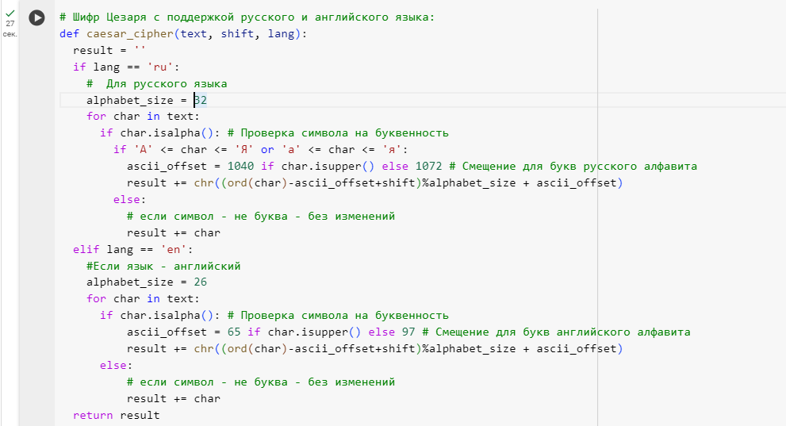
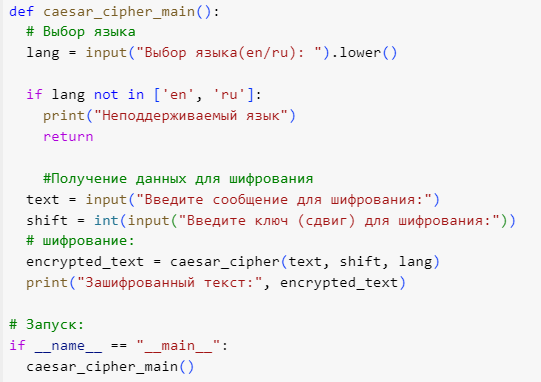
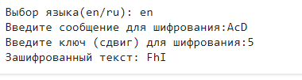
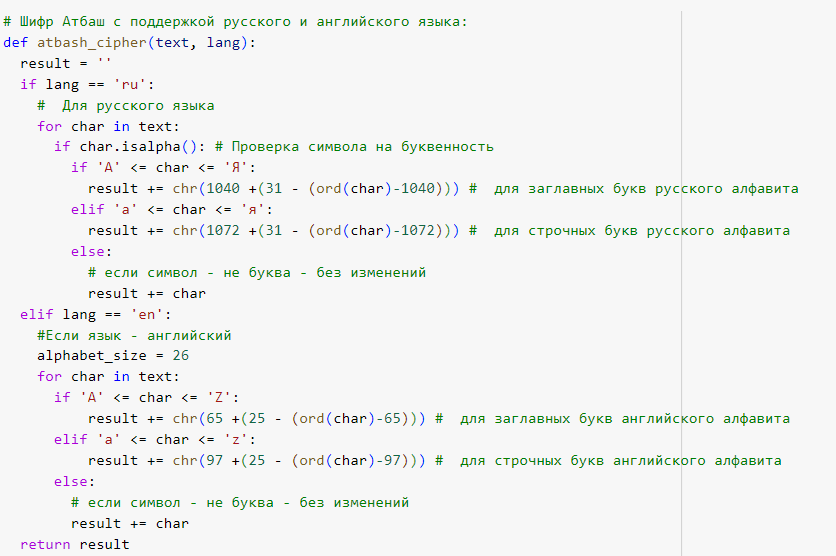
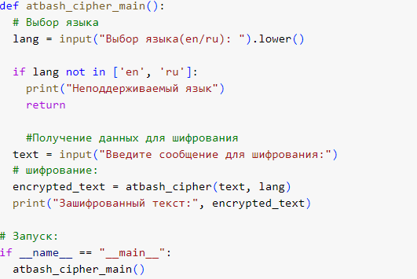
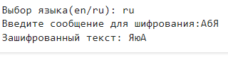

---
## Front matter
lang: ru-RU
title: Отчёт по лабораторной работе №1
author: Лабузов Александр Сергеевич
institute: РУДН, Москва, Россия

date: 14 Сентября 2024

## Formatting
toc: false
slide_level: 2
theme: metropolis
header-includes: 
 - \metroset{progressbar=frametitle,sectionpage=progressbar,numbering=fraction}
 - '\makeatletter'
 - '\beamer@ignorenonframefalse'
 - '\makeatother'
aspectratio: 43
section-titles: true
---

# Презентация лабораторной работы №1

## Цель работы

- Познакомиться с шифрами простой замены: Цезаря и Атбаш.

## Задачи
1. Реализовать шифр Цезаря с произвольным ключом k.
2. Реализовать шифр Атбаш.

## Реализация функции шифра Цезаря на языке Python

- Сначала я написал функцию для шифра Цезаря на языке Python с возможностью консольного выбора языка (русский и английский)в среде google.colab. Я использовал вводимую переменную k в качестве сдвига, назвав её shift в коде. При проверке слова берётся каждый конкретный его символ (char). При этом ведётся учёт регистра символа. Если символ находится в алфавите, то берётся его код ASCII, из которого вычитается код ASCII первой буквы алфавита. Затем прибавляется сдвиг k (shift) и берётся остаток от количества символов в алфавите (русский - 32, английский 26). После чего мы определяем, какая по счёту буква в алфавите, и прибавляем код ASCII первой буквы алфавита. Затем вписываем каждый символ в result и возвращаем его.

{ width=70% }

## Реализация функции взаимодействия с пользователем

- Далее реализована функция взаимодействия с пользователем: ввод языка, сдвига и сообщения для шифровки. И реализован запуск шифра Цезаря.

{ width=70% }

## Проверка рабоспособности шифра Цезаря

- Проверка работоспособности кода:

{ width=70% }

## Функция шифра Атбаша на языке Python

- Ниже отображена реализация функции шифра Атбаша. При проверке слова берётся конкретный символ (char).Ниже реализован консольный выбор языка проверки на наличие выбранного символа в русском или английском алфавите. При этом я учёл регистр символа. Если символ находится в алфавите, то берётся код ASCII последней буквы алфавита, из которого вычитается код ASCII выбранного символа. С помощью этого мы определяем, какое значение имеет симметричный центру символ алфавита. Затем мы прибавляем код ASCII первой буквы алфавита, чтобы определить нужный нам символ. Затем вписываем каждый символ в result и возвращаем его.
 

{ width=70% }

## Функция взаимодействия с пользователем в шифре Атбаша:

- Далее реализована функция консольного взаимодействия с пользователем (ввод языка и текста) и запуск шифра:

{ width=70% }

## Проверка работоспособности шифра Атбаш

- После я вызвал написанный метод через командную строку и проверил все русские и английские буквы.

{ width=70% }

Полный код в https://colab.google: https://colab.research.google.com/drive/1SPlyX35sVhPdizVTMSHkOYhYEe9IOt6e?authuser=0#scrollTo=2P1j_7wIanEe
## Выводы

- На практике изучил работу шифров простой замены реализацией шифра Цезаря с произвольным ключом k и Атбаша.
