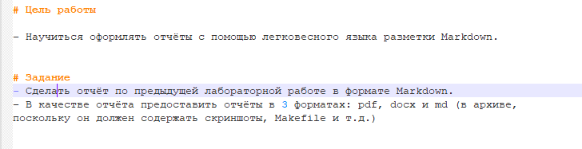
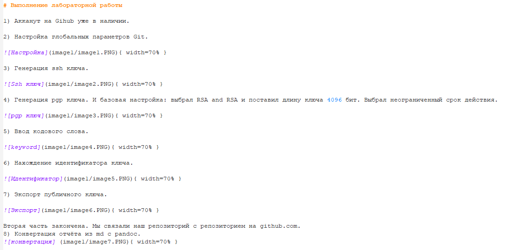
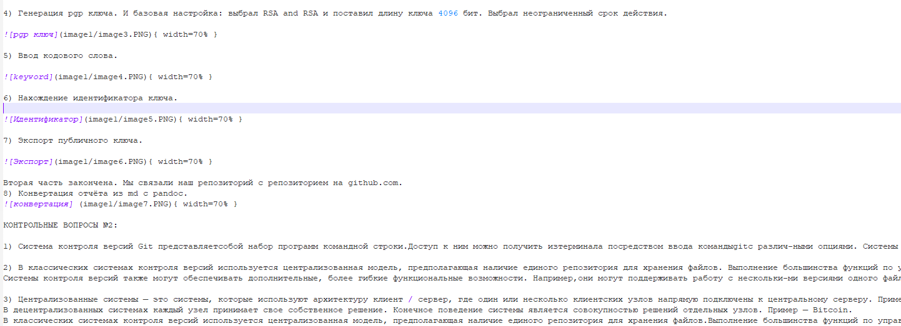
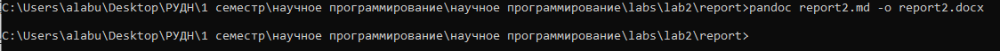

---
## Front matter
lang: ru-RU
title: Отчёт по лабораторной работе №2
author: Лабузов Александр Сергеевич
institute: РУДН, Москва, Россия
date: 14 сентября 2024

## Formatting
toc: false
slide_level: 2
theme: metropolis
header-includes: 
 - \metroset{progressbar=frametitle,sectionpage=progressbar,numbering=fraction}
 - '\makeatletter'
 - '\beamer@ignorenonframefalse'
 - '\makeatother'
aspectratio: 43
section-titles: true
---

## Цель работы

Научиться работать с Markdown и создавать pdf и docx файлы из файла Markdown (через pandoc).

## Работа с Markdown

Так как данная лабораторная работа строится на лабораторной работе №1, мы копируем основные моменты с прошлого отчёта (рис. -@fig:001).

{ #fig:001 width=70% }

## Оформляем ход работы

Расписываем полностью алгоритм работы с прошлой лабораторной работы. Обязательно указываем полную ссылку для каждого изображения при оформлении скриншота (рис. -@fig:002).

{ #fig:002 width=70% }

## Выполнение лабораторной работы

По алгоритму выполняем лабораторную работу №2 в Markdown (рис. -@fig:003).

{ #fig:003 width=70% }

## Создание отчета в трёх форматах

С помощью команды make мы можем дополнительно создать два файла в формате pdf и docx (рис. -@fig:004).

{ #fig:004 width=70% }

## Вывод

Научился работать с Markdown, сделал отчёт по предыдущей лабораторной работе в формате Markdown. Научился конвертировать файлы Markdown в pdf и docx файлы.

