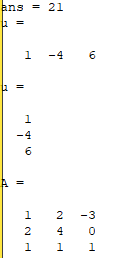
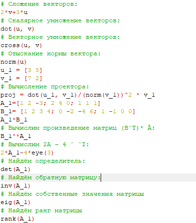
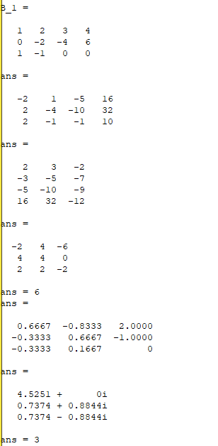
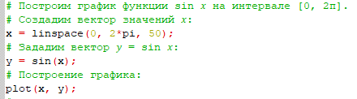
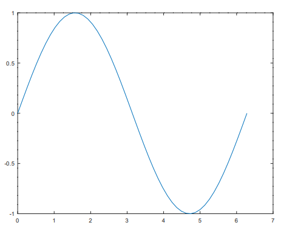

---
## Front matter
lang: ru-RU
title: Отчёт по лабораторной работе №2
author: Лабузов Александр Сергеевич
institute: РУДН, Москва, Россия
date: 14 сентября 2024

## Formatting
toc: false
slide_level: 2
theme: metropolis
header-includes: 
 - \metroset{progressbar=frametitle,sectionpage=progressbar,numbering=fraction}
 - '\makeatletter'
 - '\beamer@ignorenonframefalse'
 - '\makeatother'
aspectratio: 43
section-titles: true
---

## Цель работы

– Научиться выполнять простые операции с числами, векторами и матрицами в Octave. Вычислять проектор. Строить графики (точечно и по функциям)в Octave, а также задавать свойства графикам: цвет, легенду, ширину. Использовать циклы в Octave.

## Задание
- Использовать простейшие операции Octave
– Познакомиться с операциями с векторами, матрицами, вычислением проектора в Оctave
- Построить простейшие графики
- Построить 2 графика на одном черетеже
- Построить график функции по точкам
- Сравнить цикл и операцию с вектором, записанные в других файлах, 

## Выполнение простейших операций 

 Выполнил простейшие операции.

{ width=70% }

## Результат работы

На изображении ниже приведён результат выполнения простейших операций.

{ width=70% }

## Выполнение операций с векторами и матрицами

Произвёл некоторые операции с векторами и матрицами.

{ width=70% }

## Результат работы с векторами и матрицами

На изображениях ниже приведён результат выполнения операций с векторами и матрицами.

{ width=70% }

{ width=70% }

## Построение простейшего графика

Построил простейший график.

{ width=70% }

## Простейший график

Вывод графика.

{ width=70% }

## Отрисовка более сложных графиков и запуск цилков

Отрисовал более сложные графики с заданием параметров

![Отрисовка и запуск] (image1/image8.PNG){ width=70% }

## Улучшенный график
![Улучшенный] (image1/image9.PNG){ width=70% 

## Два графика на одном чертеже
![2 графика] (image1/image10.PNG){ width=70% 

# Выводы

Научился выполнять простые операции с числами, векторами и матрицами в Octave. Вычислять проектор. Строить графики (точечно и по функциям)в Octave, а также задавать свойства графикам: цвет, легенду, ширину. Использовать циклы в Octave.