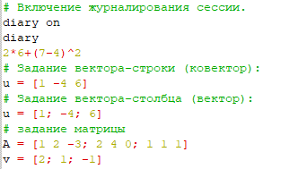
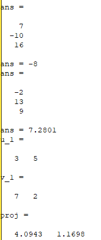

---
# Front matter
lang: ru-RU
title: "Лабораторная работа №2"
subtitle: "Дисциплина: Научное программирование"
author: "Лабузов Александр Сергеевич"

# Formatting
toc-title: "Содержание"
toc: true # Table of contents
toc_depth: 2
lof: true # Список рисунков
lot: true # Список таблиц
fontsize: 12pt
linestretch: 1.5
papersize: a4paper
documentclass: scrreprt
polyglossia-lang: russian
polyglossia-otherlangs: english
mainfont: PT Serif
romanfont: PT Serif
sansfont: PT Sans
monofont: PT Mono
mainfontoptions: Ligatures=TeX
romanfontoptions: Ligatures=TeX
sansfontoptions: Ligatures=TeX,Scale=MatchLowercase
monofontoptions: Scale=MatchLowercase
indent: true
pdf-engine: lualatex
header-includes:
  - \linepenalty=10 # the penalty added to the badness of each line within a paragraph (no associated penalty node) Increasing the value makes tex try to have fewer lines in the paragraph.
  - \interlinepenalty=0 # value of the penalty (node) added after each line of a paragraph.
  - \hyphenpenalty=50 # the penalty for line breaking at an automatically inserted hyphen
  - \exhyphenpenalty=50 # the penalty for line breaking at an explicit hyphen
  - \binoppenalty=700 # the penalty for breaking a line at a binary operator
  - \relpenalty=500 # the penalty for breaking a line at a relation
  - \clubpenalty=150 # extra penalty for breaking after first line of a paragraph
  - \widowpenalty=150 # extra penalty for breaking before last line of a paragraph
  - \displaywidowpenalty=50 # extra penalty for breaking before last line before a display math
  - \brokenpenalty=100 # extra penalty for page breaking after a hyphenated line
  - \predisplaypenalty=10000 # penalty for breaking before a display
  - \postdisplaypenalty=0 # penalty for breaking after a display
  - \floatingpenalty = 20000 # penalty for splitting an insertion (can only be split footnote in standard LaTeX)
  - \raggedbottom # or \flushbottom
  - \usepackage{float} # keep figures where there are in the text
  - \floatplacement{figure}{H} # keep figures where there are in the text
---

# Цель работы

– Научиться выполнять простые операции с числами, векторами и матрицами в Octave. Вычислять проектор. Строить графики (точечно и по функциям)в Octave, а также задавать свойства графикам: цвет, легенду, ширину. Использовать циклы в Octave.

# Задание
- Использовать простейшие операции Octave
– Познакомиться с операциями с векторами, матрицами, вычислением проектора в Оctave
- Построить простейшие графики
- Построить 2 графика на одном черетеже
- Построить график функции по точкам
- Сравнить цикл и операцию с вектором, записанные в других файлах, 

# Выполнение лабораторной работы

1) Выполняю простейшие операции 

{ width=70% }

2) Результат работы:

{ width=70% }

3) Выполнение операций с векторами и матрицами

{ width=70% }

4) Результат работы с векторами и матрицами: 

{ width=70% }

{ width=70% }

6) Построение простейшего графика:

{ width=70% }

7) Простейший график:

{ width=70% }

8) Отрисовка более сложных графиков и запуск цилков:
![Отрисовка и запуск] (image1/image8.PNG){ width=70% }

9) Улучшенный график:
![Улучшенный] (image1/image9.PNG){ width=70% 

10) Два графика на одном чертеже
![2 графика] (image1/image10.PNG){ width=70% 

# Выводы

Научился выполнять простые операции с числами, векторами и матрицами в Octave. Вычислять проектор. Строить графики (точечно и по функциям)в Octave, а также задавать свойства графикам: цвет, легенду, ширину. Использовать циклы в Octave.